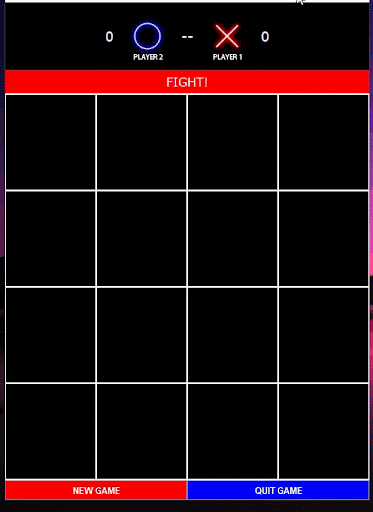

# Event Driven Programming - Tic-Tac-Toe 4x4

## Table of contents

- [Overview](#overview)
  - [Screenshot](#screenshot)
- [My process](#my-process)
  - [Built with](#built-with)
  - [What I learned](#what-i-learned)
- [Author](#author)
- [Acknowledgments](#acknowledgments)

## Overview

### Screenshot

#### Tic-Tac-Toe 4x4 Preview

---

## My process

### Built with

- Java Swing

### What I learned

Learned to program a Tic Tac Toe game where a two player will take turns, keep track of their scores, and declares a winner when a winning combination is found. 

## Author

- Website - [Shanice](https://github.com/sdacleofe/about-me)

## Acknowledgments

I want to express my gratitude to my event-driven programming course instructor for imparting knowledge about the concept of Java GUI to us.

**This laboratory activity was made on March 30, 2022**
